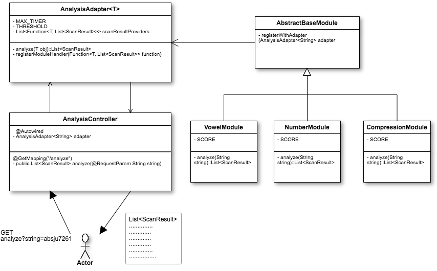

# JavaExamples
This repository contains various example of Java programming featuring various design patterns, different designs for achieving efficient concurrency and using latest features of JAVA like stream, functional interfaces and lambda.

### Problem Statement
Design an efficient solution where a bunch of operations are performed on a string value that is passed by the user. After the evaluation of the string, the service should send a list of alerts back to the user.
The string operations in the example includes the following:

* Presence of Vowel in the string should generate an alert.
* Presence of Number should generate an alert
* Compress the string and send alert with the compression ratio

Each of these alerts contain a score and the final list containing these alerts should be arrange in the order of score.

### Solutions:
This a spring rest service and the user sends the string using a rest call.
Each of these operation are performed in a separate modules.
The goal is to run all these modules concurrently as the string arrives to run efficiently.

Register each modules at the start of an application using "autoriwre". Therefore, when a user send a string request, the adapter goes through each of these modules registered and spin up a thread for each to run concurrently.
After the execution of all the threads, it collects the result from the future and sorts the result before it sends back to the user.

How do you register each modules and how does the thread starts?
Remember, that in order to register each modules, it basically registers it’s analyze method. This is achieved using the Function one of the functional-interface's in Java 8.
In our case the the function arguments are string which is as an Input and List<ScanResult> as an output. So, we register the function pointer at the start up. When the user sends a string, the Adapter goes through each functionPointers and spin up a thread and execute the method from the function pointers.
Note that, we are using Callable such that when each of these methods get applied, it returns the List<ScanResult>.
After each of the execution is completed, we collect the result from the future and add it to our List<ScanResult> which is subsequently sent back to the user.

## Class Diagram
 

### Test:
```
http://localhost:8080/analyze?string=asadasdasda8797hksd87wjkfd
```
